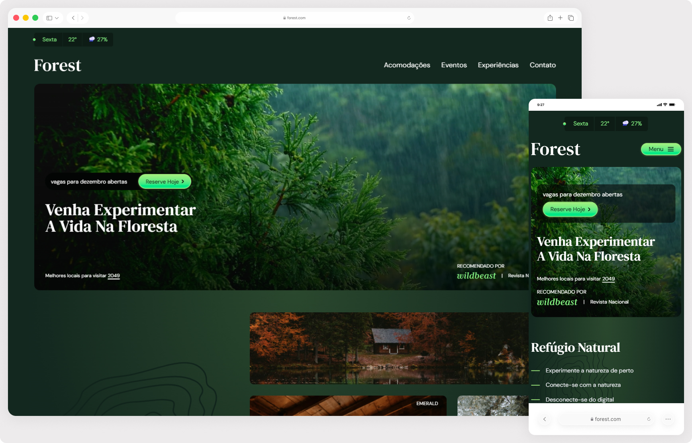

# Forest 🌿

Site de ecoturismo desenvolvido como projeto de estudo, com foco em estilização moderna usando Tailwind CSS v4 e componentização com React.

> Status do projeto: Em desenvolvimento ⌛

## Acesse o projeto

🔗 https://forest-self-gamma.vercel.app/

## Funcionalidades

- Hero com vídeo dinâmico que alterna conforme a temperatura simulada
- Seções de acomodações, eventos, experiências e contato
- Menu mobile com abertura e fechamento por overlay
- Layout totalmente responsivo com menu mobile
- Calendário de eventos com cards interativos
- Seção de experiências com efeitos de hover

## Objetivos técnicos

- Componentização com React e reutilização de componentes 
- Estilização com Tailwind CSS v4 - nova sintaxe com `@theme` e `@utility`
- Cores customizadas via variáveis CSS no tema do Tailwind
- Animações com `@keyframes` integradas ao tema
- Layout responsivo com Grid e Flexbox do Tailwind
- Importação de SVGs como componentes React com vite-plugin-svgr
- Organização semântica do HTML

## Tecnologias

- React
- Tailwind CSS v4
- Vite
- JavaScript (ES6+)

## 👀 Preview

